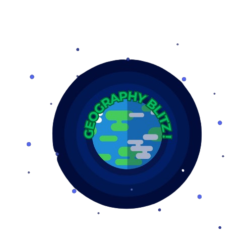

<!DOCTYPE html>

<!--
 // WEBSITE: https://themefisher.com
 // TWITTER: https://twitter.com/themefisher
 // FACEBOOK: https://www.facebook.com/themefisher
 // GITHUB: https://github.com/themefisher/
-->

<html>
<head>
    <meta charset="utf-8">
    <title>Geography Blitz !</title>

    <!-- mobile responsive meta -->
    <meta name="viewport" content="width=device-width, initial-scale=1">
    <meta name="viewport" content="width=device-width, initial-scale=1, maximum-scale=1">
  
    <!-- theme meta -->
    <meta name="theme-name" content="galaxy" />

    <!-- ** Plugins Needed for the Project ** -->
    <!-- Bootstrap -->
    <link rel="stylesheet" href="plugins/bootstrap/bootstrap.min.css">
    <link rel="stylesheet" href="plugins/fontawesome/css/all.css">

    <!-- Main Stylesheet -->
    <link href="css/style.css" rel="stylesheet">

    <!--Favicon-->
    <link rel="shortcut icon" href="images/favicon.png" type="image/x-icon">
    <link rel="icon" href="images/favicon.png" type="image/x-icon">

</head>
<body>
    <!-- START preloader-wrapper -->
    

        

            

        

    

    <!-- END preloader-wrapper -->
    
    <!-- START main-wrapper -->
    <section class="d-flex">
  
<!-- start of sidenav -->
<aside>

    
    <!-- end of navbar-brand -->

    

        <ul class="navbar-nav w-100">
            <li class="nav-item active">
                <a class="nav-link text-white px-0 pt-0" href="index.html">Home</a>
            </li>
            <li class="nav-item">
                <a class="nav-link text-white px-0" href="about.html">How to Play</a>
            </li>
            <li class="nav-item ">
                <a class="nav-link text-white px-0" href="index-2.html">G-Sections</a>
            </li>
            <li class="nav-item ">
                <a class="nav-link text-white px-0" href="privacy.html">References</a>
            </li>
        </ul>
    

    <!-- end of navbar -->

    <ul class="list-inline nml-2">
    </ul>
    <!-- end of social-links -->

</aside>
<!-- end of sidenav -->
    

        <!-- start of mobile-nav -->
<header class="mobile-nav pt-4">
    

        

            

                
            

            

                <button class="nav-toggle bg-transparent border text-white">
                    
                </button>
            

        

    

</header>

<!-- end of mobile-nav -->

        

            

                

                    

                        <h1 class=".h1">Geography Blitz!</h1>
                        
Welcome to this learning engagement plaftorm designed for helping IB Students in learning and testing Geography knowledge, to help in subjects like Integrated Humanities, Geography and History. Designed for optimal learning reinforcement through quiz-based interactions, this progressive and adaptive website is designed to help you learn Geography while simultaneously developing curiosity and interest for the subject. So, what are you waiting for? Start Learning!

                    

                    

                        
                        

                            <h2 class="card-title">
                                <a class="text-white opacity-75-onHover" href="#">Capitals of the World Quiz</a>
                            </h2>
                            <ul class="post-meta mt-3">
                                <li class="d-inline-block mr-3">
                                    
                                    <a class="ml-1" href="#">4th February, 2024</a>
                                </li>
                                <li class="d-inline-block">
                                    
                                    <a class="ml-1" href="#">Multiple Choice Type</a>
                                </li>
                            </ul>
                            
Test your knowledge of the capitals of the world in this quiz with three levels of difficulty. Are you ready to put your general awareness, memory and geography skills to the test against this quiz designed to help you learn the capitals in an interactive manner? Play and Find out.

                            <a href = "capMain.html" class="btn btn-primary">Play Quiz </a>
                        

                    

                    <!-- end of post-item -->
                    
                    

                        
                        

                            <h2 class="card-title">
                                <a class="text-white opacity-75-onHover" href="#">Flags of the World Quiz</a>
                            </h2>
                            <ul class="post-meta mt-3">
                                <li class="d-inline-block mr-3">
                                    
                                    <a class="ml-1" href="#">8th February, 2024</a>
                                </li>
                                <li class="d-inline-block">
                                    
                                    <a class="ml-1" href="#">Multiple Choice Type + Image</a>
                                </li>
                            </ul>
                            
Test your knowledge of the flags of the world in this quiz with three levels of difficulty. Are you ready to put your image recognition, memory and geography skills to crack this quiz to help you learn the basics of Vexillology and memorize flags in an interactive manner? Play and Find out.

                            <a href="flagMain.html" class="btn btn-primary">Play Quiz </a>
                        

                    

                    <!-- end of post-item -->
                    
                    

                        
                        

                            <h2 class="card-title">
                                <a class="text-white opacity-75-onHover" href="#">Country Outlines of the World Quiz</a>
                            </h2>
                            <ul class="post-meta mt-3">
                                <li class="d-inline-block mr-3">
                                    
                                    <a class="ml-1" href="#">20th February, 2024</a>
                                </li>
                                <li class="d-inline-block">
                                    
                                    <a class="ml-1" href="#">Multiple Choice Type + Image</a>
                                </li>
                            </ul>
                            
Test your knowledge of country outlines of the world in this quiz with three levels of difficulty. Are you ready to put your spatial memory, image recognition and geography skills to the test against this quiz designed to help you visualize the World Map and countries for benefit in assessments and recollecting examples? Play and Find out.

                            <a href="outlineMain.html" class="btn btn-primary">Play Quiz </a>
                        

                    

                    <!-- end of post-item -->

                    

                        
                        

                            <h2 class="card-title">
                                <a class="text-white opacity-75-onHover" href="#">Geography - More than Meets the Eye</a>
                            </h2>
                            <ul class="post-meta mt-3">
                                <li class="d-inline-block mr-3">
                                    
                                    <a class="ml-1" href="#">Weekly Basis</a>
                                </li>
                                <li class="d-inline-block">
                                    
                                    <a class="ml-1" href="#">Sections - Quiz</a>
                                </li>
                            </ul>
                            
Geography is more than what it meets the eye. Explore how Geopolitics and Global Economy, Diversity and Inclusion and the Environment are connected with Geography. Learn how Geography impacts Geopolitics and Economics using contemporary examples tested through interactive general awareness quizzes, which get uploaded on a weekly basis. This section is designed to help you understand how Geography plays a key role in our Environment, Economy and Society and is the fundamental requirement for the existence of human civilization. Explore these Sections now!

                            <a href="index-2.html" class="btn btn-primary">Explore</a>
                        

                    

                    <!-- end of post-item -->
                

                

                    

                        
                        <h2 class="widget-title text-white d-inline-block mt-4">About Me</h2>
                        
I am an IB Student studying in Grade 10, living in Pune, India, who aspires to achieve a career in Physics and Economics. Nevertheless, I have had a keen interest in Geography developed from reading Encylopedias and spending hours online playing quizzes in various gamemodes and layouts. I realized that Geography typically seemed like a boring or mindless subject of memorization for many IB Students or even a subject paid least attention to. After reading the fascinating and mindblowing non-fictional book, Prisoners of Geography authored by Tim Marshall, I came to the understanding that Geography impacts all of the subject disciplines studied in Integrated Humanities like Civics, Economics, Environmental Sciences and History. In order to make Geography an interactive and amusing subject for many of my peers, I decided to use my experience gained from playing online quizzes into creating a learning engagement platform to learn about Geography and its impacts on the orientations of human life across the globe in the contemporary era. This is why I created Geography Blitz! for my IB E-portfolio in Digital Design.

                    

                    <!-- end of author-widget -->

                    

                        <h2 class="widget-title text-white d-inline-block mt-4">The 3 Earths</h2>
                        
When you'll click on the Geography Quizzes (Not the Sections), you will notice 3 Planets as a reference to the shift in tectonic plates occuring over millions of years that have led to the evolution of the shape of landmasses and continents throughout Earth's history, signifying the progression of your learning through the Levels. So please don't be scared why the Planet Images have been mushed and distorted, because they haven't. 😊 

                        
The 1st Planet showcases Pangea, the super landmass in the Triassic Period of Earth's History (when Dinosaurs came into existence), 2nd Planet showcasing continents Laurasia and Gondwana around the Cretaceous Period (When Dinosaurs flourished) and the 3rd Planet showcasing the modern continents. Now keep learning!

                    

                    

                    <!-- end of post-items widget -->
                

            

        

    

    </section>
    <!-- END main-wrapper -->

    <!-- All JS Files -->
    
    

    <!-- Main Script -->
    
</body>
</html>
